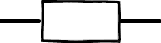
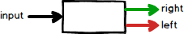
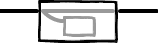
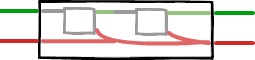
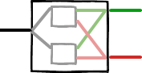

# Railway Oriented Programming (ROP)

A PHP implementation of Railway Oriented Programming pattern for elegant error handling.

## Motivation

Typically every use case receives a request and produces a response. The use case passes for several steps until gets the final response to be returned. Handle every error scenario could be tedious and difficult to read.

## Overview

Railway Oriented Programming is a functional programming pattern that helps manage complexity in error handling by treating the flow of data like a railway track with two lines:

- Success track (happy path)
- Failure track (error path)

> Railways have switches ("points" in the UK) for directing trains onto a different track. We can think of these "Success/Failure" functions as railway switches.

### One Track Function (1-1)
Has 1 input and 1 output.



### Two Track Function (2-2)
Has 2 inputs (`Result`) and 2 outputs (`Result`).


### Switch (1-2)
Has 1 input and 2 outputs (`Result`).


## Core Types

### Result Monad

In order to have a type that works with any workflow, we borrow the type `Result` from functional programming:



This object acts as a **switch**, where _left_ means failure and the _right_ means success.

The foundational type that represents either success or failure:

```php
use ROP\Result;

// Create success result
$success = Result::success(42);
$value = $success->getValue();    // 42
$error = $success->getError();    // null
$isSuccess = $success->isSuccess(); // true

// Create failure result
$failure = Result::failure("Invalid input");
$value = $failure->getValue();    // null
$error = $failure->getError();    // "Invalid input"
$isSuccess = $failure->isSuccess(); // false
```

### Railway Core Class

Builds on top of Result to provide a fluent interface for chaining operations:

```php
use ROP\Railway;

$result = Railway::of(42)
    ->map(fn($x) => $x * 2)
    ->bind(fn($x) => validateNumber($x));
```

### Pipe

Utility class for composing functions left-to-right:

```php
use ROP\Pipe;

// Compose functions
$pipeline = Pipe::of(
    fn($x) => $x + 1,
    fn($x) => $x * 2,
    fn($x) => "Result: $x"
);

// Execute pipeline
$result = $pipeline(5);  // "Result: 12"

// With Railway
$railway = Railway::of(5)
    ->bind(Pipe::of(
        fn($x) => $x + 1,
        fn($x) => validateNumber($x),
        fn($x) => saveToDatabase($x)
    ));
```

## Installation

```bash
composer require your-vendor/rop
```

## Quick Start

```php
use ROP\Railway;

// Simple value transformation
$result = Railway::of(42)
    ->map(fn($x) => $x * 2)
    ->map(fn($x) => $x + 1)
    ->match(
        fn($value) => "Success: $value",
        fn($error) => "Error: $error"
    );

// Error handling
$result = Railway::of($userData)
    ->map(fn($data) => new User($data))         // transform data
    ->bind(fn($user) => validateUser($user))    // might fail
    ->bind(fn($user) => saveToDatabase($user))  // might fail
    ->tee(fn($user) => sendWelcomeEmail($user)) // side effect
    ->match(
        fn($user) => ['success' => true, 'id' => $user->id],
        fn($error) => ['success' => false, 'error' => $error]
    );
```

## Core Concepts

### Creating Railways

Railway is a class that allows you to create a Railway instance. It takes a value and returns a Railway.

```php
// Success path
$success = Railway::of($value);

// Failure path
$failure = Railway::fail($error);

// From existing Result
$railway = Railway::fromResult($result);
```

### Mapping Operations

#### Map (Success Only)

Map is a method that allows you to transform the success value of a Railway. It takes a function that transforms the success value and returns a Railway.


```php
$result = Railway::of(42)
    ->map(fn($x) => $x * 2);  // transforms success value
```

#### DoubleMap (Both Tracks)

Maps both success and failure paths simultaneously. Useful when you need to transform both success and error values:


```php
// Transform both success and error values
$result = Railway::of(42)
    ->doubleMap(
        fn($value) => $value * 2,           // success transformer
        fn($error) => "Error: $error"       // error transformer
    );

// Real-world example: API response formatting
$apiResult = fetchUserData($userId)          // Railway<User, ApiError>
    ->doubleMap(
        fn(User $user) => [                 // success case
            'status' => 'success',
            'data' => [
                'id' => $user->id,
                'name' => $user->name,
                'email' => $user->email
            ]
        ],
        fn(ApiError $error) => [            // error case
            'status' => 'error',
            'code' => $error->getCode(),
            'message' => $error->getMessage()
        ]
    );

// Localization example
$message = Railway::of($value)
    ->doubleMap(
        fn($val) => translate("success.$val"),
        fn($err) => translate("error.$err")
    );

// Type conversion example
$result = validateInput($data)              // Railway<int, string>
    ->doubleMap(
        fn(int $n) => new SuccessResponse($n),
        fn(string $err) => new ErrorResponse($err)
    );
```

### Bind

Bind is a method that allows you to chain operations that might fail. It takes a function that returns a Railway and returns a Railway.


```php
// Chain operations that might fail
$result = Railway::of($input)
    ->bind(fn($x) => validateInput($x))   // returns Railway
    ->bind(fn($x) => processData($x));    // returns Railway
```

### Error Handling

TryCatch is a method that allows you to wrap an existing try/catch block in a Railway. It takes a function that returns a Railway and returns a Railway.


```php
// Try/catch wrapper
$result = Railway::of($riskyData)
    ->tryCatch(
        fn($data) => riskyOperation($data),
        fn(\Throwable $e) => "Failed: " . $e->getMessage()
    );

// Combine multiple operations
$result = Railway::plus(
    fn($r1, $r2) => $r1 + $r2,        // success combiner
    fn($errors) => implode(", ", $errors),  // error combiner
    $railway1,
    $railway2
);
```

### Side Effects

Tee is a method that allows you to perform side effects on a Railway. It takes a function that performs the side effect and returns a Railway.



```php
$result = Railway::of($user)
    ->tee(fn($u) => logger("Processing user: {$u->id}"))
    ->bind(fn($u) => updateUser($u))
    ->tee(fn($u) => logger("User updated: {$u->id}"));
```

### Pattern Matching

Match is a method that allows you to match on the success or failure of a Railway. It takes a function that returns a Railway and returns a Railway.

```php
$message = $railway->match(
    success: fn($value) => "Success: $value",
    failure: fn($error) => "Error: $error"
);
```

### Lifting Functions

Lift is a method that allows you to convert regular functions into Railway-compatible ones. It takes a function and returns a Railway.


```php
use ROP\Railway;

// Regular function
$double = fn($x) => $x * 2;

// Lift into Railway
$liftedDouble = Railway::lift($double);

// Use lifted function
$result = Railway::of(21)
    ->bind($liftedDouble);  // Railway<42, never>

// Compose multiple lifted functions
$result = Railway::of($input)
    ->bind(Railway::lift(validateInput))
    ->bind(Railway::lift(transform))
    ->bind(Railway::lift(save));
```

### Combining Railways

#### Unite

Joins two Railways, taking the second Railway's value if the first one succeeds:



```php
// Form validation example
$requiredCheck = Railway::of($form->email)
    ->bind(fn($email) => validateRequired($email));    // Railway<string, ValidationError>

$emailCheck = Railway::of($form->email)
    ->bind(fn($email) => validateEmail($email));      // Railway<string, ValidationError>

$result = $requiredCheck->unite($emailCheck);

// File processing example
$existsCheck = Railway::of($path)
    ->bind(fn($p) => checkFileExists($p));           // Railway<string, FileError>

$permissionCheck = Railway::of($path)
    ->bind(fn($p) => checkFilePermissions($p));      // Railway<bool, FileError>

$contentReader = Railway::of($path)
    ->bind(fn($p) => readFileContents($p));          // Railway<string, FileError>

$result = $existsCheck
    ->unite($permissionCheck)
    ->unite($contentReader);

```

The `unite` method is particularly useful when:
- You have a sequence of validations
- You need to perform setup steps before an operation
- You want to chain operations but only care about the final result
- You're building a pipeline where intermediate results aren't needed


#### PlusWith

Combines two Railways in parallel, allowing custom combination of success and failure values:



```php
// Combine user and profile data
$userResult = fetchUser($id);        // Railway<User, DbError>
$profileResult = fetchProfile($id);   // Railway<Profile, DbError>

$combined = $userResult->plusWith(
    // Combine success values
    fn(User $user, Profile $profile) => [
        'id' => $user->id,
        'name' => $user->name,
        'avatar' => $profile->avatar
    ],
    // Combine errors
    fn(array $errors) => implode(', ', $errors),
    $profileResult
);

// Parallel validation example
$emailValidation = validateEmail($email);     // Railway<string, ValidationError>
$passwordValidation = validatePassword($pwd);  // Railway<string, ValidationError>

$result = $emailValidation->plusWith(
    fn($email, $password) => new Credentials($email, $password),
    fn($errors) => new ValidationErrors($errors),
    $passwordValidation
);
```

#### Plus (Static Version)

Static version of plusWith for combining multiple Railways:


```php
$result = Railway::plus(
    // Combine success values
    fn($user, $profile) => new UserProfile($user, $profile),
    // Combine errors
    fn($errors) => new CombinedError($errors),
    $userResult,
    $profileResult
);
```

## Type Safety

The library provides full type safety with PHP 8.0+ and PHPStan:

```php
/** @var Railway<User, ValidationError> */
$result = Railway::of($userData)
    ->map(fn(array $data): User => new User($data))
    ->bind(fn(User $user): Railway => validateUser($user));

/** @var Railway<Order, DbError|ValidationError> */
$order = Railway::of($orderData)
    ->bind(fn($data) => validateOrder($data))  // might return ValidationError
    ->bind(fn($data) => saveOrder($data));     // might return DbError
```

## Benefits

1. **Explicit Error Handling**: No hidden exceptions or null checks
2. **Composable Operations**: Chain transformations and error handling
3. **Type Safety**: Full type inference and checking with PHPStan
4. **Immutable**: No side effects or state mutations
5. **Readable**: Clear, linear flow of operations
6. **Flexible**: Handle any combination of success/error types
7. **Maintainable**: Easy to add new transformations or error cases

## Railway Api Patterns

1. Use `map` for simple transformations
2. Use `bind` when operations might fail
3. Use `tee` for logging and side effects
4. Use `tryCatch` to wrap existing try/catch blocks
5. Use `lift` to convert regular functions into Railway-compatible ones
6. Use `unite` when chaining operations and only care about the final result
7. Use `plusWith` when combining multiple Railways with custom error handling
8. Use `plus` when combining multiple Railways with default error handling
9. Use type hints when combining multiple error types
10. Keep transformations small and focused
11. Use descriptive error types instead of strings

## Contributing

Contributions are welcome! Please feel free to submit a Pull Request.

## License

This project is licensed under the MIT License - see the LICENSE file for details.
