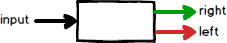
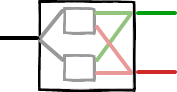

# Railway Oriented Programming (ROP)

A PHP implementation of Railway Oriented Programming pattern for elegant error handling.

## Motivation

Typically every use case receives a request and produces a response. The use case passes for several steps until gets the final response to be returned. Handle every error scenario could be tedious and difficult to read.

## Overview

Railway Oriented Programming is a functional programming pattern that helps manage complexity in error handling by treating the flow of data like a railway track with two lines:

- Success track (happy path)
- Failure track (error path)

> Railways have switches ("points" in the UK) for directing trains onto a different track. We can think of these "Success/Failure" functions as railway switches.

### One Track Function (1-1)
Has 1 input and 1 output.


### Two Track Function (2-2)
Has 2 inputs (`Result`) and 2 outputs (`Result`).


### Switch (1-2)
Has 1 input and 2 outputs (`Result`).


## Core Types

### Result Monad

In order to have a type that works with any workflow, we borrow the type `Result` from functional programming:



This object acts as a **switch**, where _left_ means failure and the _right_ means success.

The foundational type that represents either success or failure:

```php
use ROP\Result;

// Create success result
$success = Result::success(42);
$value = $success->getValue();    // 42
$error = $success->getError();    // null
$isSuccess = $success->isSuccess(); // true

// Create failure result
$failure = Result::failure("Invalid input");
$value = $failure->getValue();    // null
$error = $failure->getError();    // "Invalid input"
$isSuccess = $failure->isSuccess(); // false
```

### Railway Core Class

Builds on top of Result to provide a fluent interface for chaining operations:

```php
use ROP\Railway;

$result = Railway::of(42)
    ->map(fn($x) => $x * 2)
    ->bind(fn($x) => validateNumber($x));
```

### Pipe

Utility class for composing functions left-to-right:

```php
use ROP\Pipe;

// Compose functions
$pipeline = Pipe::of(
    fn($x) => $x + 1,
    fn($x) => $x * 2,
    fn($x) => "Result: $x"
);

// Execute pipeline
$result = $pipeline(5);  // "Result: 12"

// With Railway
$railway = Railway::of(5)
    ->bind(Pipe::of(
        fn($x) => $x + 1,
        fn($x) => validateNumber($x),
        fn($x) => saveToDatabase($x)
    ));
```

## Installation

```bash
composer require skie/rop
```

## Quick Start

### Classic Railway API (Method Chaining)

```php
use ROP\Railway;

// Simple value transformation
$result = Railway::of(42)
    ->map(fn($x) => $x * 2)
    ->map(fn($x) => $x + 1)
    ->match(
        fn($value) => "Success: $value",
        fn($error) => "Error: $error"
    );

// Error handling
$result = Railway::of($userData)
    ->map(fn($data) => new User($data))         // transform data
    ->bind(fn($user) => validateUser($user))    // might fail
    ->bind(fn($user) => saveToDatabase($user))  // might fail
    ->tee(fn($user) => sendWelcomeEmail($user)) // side effect
    ->match(
        fn($user) => ['success' => true, 'id' => $user->id],
        fn($error) => ['success' => false, 'error' => $error]
    );
```

### Functional API with Pipes (PHP 8.5+)

```php
use function ROP\ok;
use function ROP\bind;
use function ROP\map;
use function ROP\tee;
use function ROP\doubleMap;

// Simple value transformation
$result = 42
    |> ok(...)
    |> map(fn($x) => $x * 2)
    |> map(fn($x) => $x + 1);

// Error handling with pipes
$result = $userData
    |> ok(...)
    |> map(fn($data) => new User($data))
    |> bind($this->validateUser(...))
    |> bind($this->saveToDatabase(...))
    |> tee($this->sendWelcomeEmail(...))
    |> doubleMap(
        fn($user) => ['success' => true, 'id' => $user->id],
        fn($error) => ['success' => false, 'error' => $error]
    );
```

## API Styles

This library provides two complementary ways to write Railway-oriented code:

1. **Railway Class API**: Object-oriented method chaining with `Railway` class
2. **Functional API**: Pure functions designed for PHP 8.5 pipe operator

Both APIs provide the same functionality - choose based on your preference and PHP version.

## Functional API with Pipes (PHP 8.5+)

The functional API provides standalone functions that work seamlessly with PHP 8.5's pipe operator (`|>`), enabling a clean, left-to-right data flow.

### Why Use Pipes?

The pipe operator makes Railway Oriented Programming more intuitive by:
- Reading left-to-right, top-to-bottom (natural reading order)
- Eliminating nested function calls
- Making data transformations explicit and linear
- Reducing cognitive load when reading complex pipelines

### Importing Functions

```php
use function ROP\ok;
use function ROP\fail;
use function ROP\map;
use function ROP\bind;
use function ROP\tryCatch;
use function ROP\tee;
use function ROP\doubleMap;
use function ROP\compose;
```

### Core Functions

#### ok() - Create Success Result

Creates a Result on the success track. This is the starting point for most pipelines.

```php
use function ROP\ok;

// Start a pipeline with a value
$result = 42 |> ok(...);

// Or without pipes
$result = ok(42);
```

**Type Signature**: `T → Result<T, never>`

#### fail() - Create Error Result

Creates a Result on the error track. Used when you need to explicitly start with an error.

```php
use function ROP\fail;

// Create an error
$result = 'Something went wrong' |> fail(...);

// Or without pipes
$result = fail('Something went wrong');
```

**Type Signature**: `E → Result<never, E>`

#### map() - Transform Success Values

Transforms the value on the success track. The error track passes through unchanged. Use this for simple transformations that don't involve error handling.

```php
use function ROP\{ok, map};

// Transform success values
$result = 21
    |> ok(...)
    |> map(fn($x) => $x * 2)      // 42
    |> map(fn($x) => "Value: $x"); // "Value: 42"

// Error track bypasses map
$error = 'error'
    |> fail(...)
    |> map(fn($x) => $x * 2);  // still fail('error')
```

**Type Signature**: `(T → R) → Result<T, E> → Result<R, E>`

**Railway Diagram**: Converts 1-track function to 2-track function (1-1 → 2-2)

#### bind() - Chain Operations That May Fail

The core function for Railway Oriented Programming. Chains operations that return Results, automatically handling the error track.

```php
use function ROP\{ok, bind};

$divide = fn($x) => $x === 0
    ? fail('Division by zero')
    : ok(10 / $x);

$validate = fn($x) => $x < 0
    ? fail('Must be positive')
    : ok($x);

// Chain operations
$result = 5
    |> ok(...)
    |> bind($validate)  // ok(5)
    |> bind($divide);   // ok(2)

// Error propagates
$result = 0
    |> ok(...)
    |> bind($validate)  // ok(0)
    |> bind($divide);   // fail('Division by zero')
```

**Type Signature**: `(T → Result<R, E>) → Result<T, E> → Result<R, E>`

**Railway Diagram**: Converts switch function to 2-track function (1-2 → 2-2)

#### tryCatch() - Handle Exceptions

Wraps exception-throwing code and converts exceptions to error Results. Perfect for integrating legacy code or external libraries.

```php
use function ROP\{ok, tryCatch};

$parseJson = fn($str) => json_decode($str, true, 512, JSON_THROW_ON_ERROR);

// Handle exceptions
$result = '{"valid": "json"}'
    |> ok(...)
    |> tryCatch($parseJson);  // ok(['valid' => 'json'])

$result = '{invalid json'
    |> ok(...)
    |> tryCatch($parseJson);  // fail('Syntax error')
```

**Type Signature**: `(T → R) → Result<T, E> → Result<R, E|string>`

**Railway Diagram**: Converts exception-throwing 1-track to switch (1-1 → 1-2 → 2-2)

#### tee() - Side Effects Without Changing Value

Executes a function for side effects (logging, debugging, notifications) without modifying the pipeline's value. Only runs on success track.

```php
use function ROP\{ok, map, tee};

$log = [];

$result = 10
    |> ok(...)
    |> tee(fn($x) => $log[] = "Input: $x")
    |> map(fn($x) => $x * 2)
    |> tee(fn($x) => $log[] = "Doubled: $x")
    |> map(fn($x) => $x + 5)
    |> tee(fn($x) => $log[] = "Result: $x");

// $log = ["Input: 10", "Doubled: 20", "Result: 25"]
// $result = ok(25)
```

**Type Signature**: `(T → void) → Result<T, E> → Result<T, E>`

**Railway Diagram**: Dead-end function converted to pass-through (stays on same track)

#### doubleMap() - Transform Both Tracks

Transforms both success and error values. Essential for formatting final results or converting error types.

```php
use function ROP\{ok, fail, bind, doubleMap};

$formatSuccess = fn($user) => [
    'status' => 'success',
    'data' => ['id' => $user->id, 'name' => $user->name]
];

$formatError = fn($error) => [
    'status' => 'error',
    'message' => $error
];

// Transform both tracks
$result = $userId
    |> ok(...)
    |> bind($this->fetchUser(...))
    |> bind($this->validateUser(...))
    |> doubleMap($formatSuccess, $formatError);

// Success: ['status' => 'success', 'data' => [...]]
// Error: ['status' => 'error', 'message' => '...']
```

**Type Signature**: `(T → S, E → F) → Result<T, E> → Result<S, F>`

**Railway Diagram**: Transforms both tracks simultaneously

#### lift() - Convert Regular Functions to Railway

Lifts a regular one-track function into Railway context, making it return a Result. Essential for integrating pure functions into Railway pipelines.

```php
use function ROP\{ok, bind, lift};

// Regular function
$double = fn($x) => $x * 2;
$triple = fn($x) => $x * 3;

// Lift and use in pipeline
$result = 7
    |> ok(...)
    |> bind(lift($double))  // ok(14)
    |> bind(lift($triple)); // ok(42)

// Without lift, you'd need to wrap manually
$manualLift = fn($x) => ok($x * 2);
$result = 7 |> ok(...) |> bind($manualLift);
```

**Type Signature**: `(T → R) → (T → Result<R, never>)`

**Railway Diagram**: Converts 1-track to switch (1-1 → 1-2)

#### plus() - Combine Two Results in Parallel

Combines two Results together, executing both paths and merging their results. If both succeed, combines success values. If either fails, collects all errors.

```php
use function ROP\{ok, fail, plus};

// Combine two successful Results
$r1 = ok(10);
$r2 = ok(32);

$result = plus(
    fn($a, $b) => $a + $b,              // combine success values
    fn($errors) => implode(', ', $errors), // combine errors
    $r1,
    $r2
); // ok(42)

// Handle errors
$r1 = ok(10);
$r2 = fail('invalid input');

$result = plus(
    fn($a, $b) => $a + $b,
    fn($errors) => implode(', ', $errors),
    $r1,
    $r2
); // fail('invalid input')

// Real-world: Parallel data fetching
$userData = $this->fetchUser($userId);
$profileData = $this->fetchProfile($userId);

$combined = plus(
    fn($user, $profile) => [...$user, 'avatar' => $profile['avatar']],
    fn($errors) => ['errors' => $errors],
    $userData,
    $profileData
);
```

**Type Signature**: `((T1, T2) → R, (E[]) → F, Result<T1, E1>, Result<T2, E2>) → Result<R, F>`

**Railway Diagram**: Combines two switches in parallel (1-2 + 1-2 → 1-2)

#### plusWith() - Combine Results in Pipeline

Pipeline-friendly version of `plus()`. Takes another Result and combines it with the current Result in the pipeline.

```php
use function ROP\{ok, bind, plusWith};

$fetchUser = fn($id) => ok(['id' => $id, 'name' => 'John']);
$fetchProfile = fn($id) => ok(['avatar' => 'john.jpg', 'bio' => 'Developer']);

$result = 123
    |> ok(...)
    |> bind($fetchUser)
    |> plusWith(
        fn($user, $profile) => [...$user, ...$profile],
        fn($errors) => implode(', ', $errors),
        $fetchProfile(123)
    );

// Result: ok(['id' => 123, 'name' => 'John', 'avatar' => 'john.jpg', 'bio' => 'Developer'])

// Parallel validation
$validateEmail = fn($data) =>
    filter_var($data['email'], FILTER_VALIDATE_EMAIL)
        ? ok($data['email'])
        : fail('Invalid email');

$validatePassword = fn($data) =>
    strlen($data['password']) >= 8
        ? ok($data['password'])
        : fail('Password too short');

$result = $formData
    |> ok(...)
    |> bind($validateEmail)
    |> plusWith(
        fn($email, $password) => ['email' => $email, 'password' => $password],
        fn($errors) => ['validation_errors' => $errors],
        $validatePassword($formData)
    );
```

**Type Signature**: `((T1, T2) → R, (E[]) → F, Result<T2, E2>) → (Result<T1, E1> → Result<R, F>)`

#### unite() - Sequential Result Chaining

Chains two Results sequentially, returning the second if the first succeeds. If the first fails, short-circuits and returns the first error. Perfect for validation chains where you only care about the final result.

```php
use function ROP\{ok, bind, unite};

// Validation chain
$checkRequired = fn($value) =>
    empty($value) ? fail('Field is required') : ok($value);

$checkLength = fn($value) =>
    strlen($value) < 3 ? fail('Minimum 3 characters') : ok($value);

$checkFormat = fn($value) =>
    !preg_match('/^[a-z]+$/', $value) ? fail('Only lowercase letters') : ok($value);

// All validations pass
$result = 'hello'
    |> ok(...)
    |> bind($checkRequired)
    |> unite(ok('hello') |> bind($checkLength))
    |> unite(ok('hello') |> bind($checkFormat));
// ok('hello')

// First failure short-circuits
$result = 'ab'
    |> ok(...)
    |> bind($checkRequired)
    |> unite(ok('ab') |> bind($checkLength))    // fails here
    |> unite(ok('ab') |> bind($checkFormat));   // never executed
// fail('Minimum 3 characters')

// File operations example
$checkExists = $this->checkFileExists($path);
$checkPermissions = $this->checkFilePermissions($path);
$readContents = $this->readFile($path);

$result = $checkExists
    |> unite($checkPermissions)
    |> unite($readContents);
// Only reads file if both checks pass
```

**Type Signature**: `Result<T2, E2> → (Result<T1, E1> → Result<T2, E1|E2>)`

**Railway Diagram**: Join two switches sequentially (1-2 and 1-2 → 1-2)

**Key Difference from `bind()`**:
- `bind()`: Takes a function and calls it with the success value
- `unite()`: Takes an already-computed Result and returns it if first succeeds

#### compose() - Build Reusable Pipelines

Combines multiple functions into a single reusable function. Unlike pipes (which execute immediately), compose creates a function you can reuse.

```php
use function ROP\{ok, map, bind, compose};

// Create reusable pipeline
$validateAndSave = compose(
    bind($this->validateInput(...)),
    map($this->enrichData(...)),
    bind($this->saveToDatabase(...)),
    map($this->formatResponse(...))
);

// Reuse pipeline multiple times
$result1 = ok($data1) |> $validateAndSave;
$result2 = ok($data2) |> $validateAndSave;
$result3 = ok($data3) |> $validateAndSave;
```

**Type Signature**: `(f1, f2, ..., fn) → (x → fn(...f2(f1(x))))`

### Real-World Example: User Registration

```php
use function ROP\{ok, bind, map, tee, tryCatch, doubleMap};

class UserService
{
    public function register(array $data): array
    {
        $validateEmail = fn($data) =>
            filter_var($data['email'], FILTER_VALIDATE_EMAIL)
                ? ok($data)
                : fail('Invalid email address');

        $checkDuplicate = fn($data) =>
            $this->emailExists($data['email'])
                ? fail('Email already registered')
                : ok($data);

        $hashPassword = fn($data) => [
            ...$data,
            'password' => password_hash($data['password'], PASSWORD_DEFAULT)
        ];

        $createUser = fn($data) =>
            $this->db->insert('users', $data)
                ? ok($this->db->lastInsertId())
                : fail('Failed to create user');

        return $data
            |> ok(...)
            |> bind($validateEmail)
            |> bind($checkDuplicate)
            |> map($hashPassword)
            |> tryCatch($createUser)
            |> tee(fn($id) => $this->sendWelcomeEmail($id))
            |> tee(fn($id) => $this->logger->info("User created: $id"))
            |> doubleMap(
                fn($id) => ['success' => true, 'userId' => $id],
                fn($error) => ['success' => false, 'error' => $error]
            )
            |> fn($result) => $result->getValue() ?? $result->getError();
    }
}
```

### Comparison: Railway Class vs Functions

**Railway Class (Method Chaining)**:
```php
$result = Railway::of($data)
    ->map(fn($x) => $x * 2)
    ->bind(fn($x) => validate($x))
    ->tee(fn($x) => log($x))
    ->match(
        fn($val) => ['success' => $val],
        fn($err) => ['error' => $err]
    );
```

**Functional API (Pipes)**:
```php
$result = $data
    |> ok(...)
    |> map(fn($x) => $x * 2)
    |> bind($this->validate(...))
    |> tee($this->log(...))
    |> doubleMap(
        fn($val) => ['success' => $val],
        fn($err) => ['error' => $err]
    );
```

Both produce identical results - choose based on your preference!

## Core Concepts

### Creating Railways

Railway is a class that allows you to create a Railway instance. It takes a value and returns a Railway.

```php
// Success path
$success = Railway::of($value);

// Failure path
$failure = Railway::fail($error);

// From existing Result
$railway = Railway::fromResult($result);
```

### Mapping Operations

#### Map (Success Only)

Map is a method that allows you to transform the success value of a Railway. It takes a function that transforms the success value and returns a Railway.


```php
$result = Railway::of(42)
    ->map(fn($x) => $x * 2);  // transforms success value
```

#### DoubleMap (Both Tracks)

Maps both success and failure paths simultaneously. Useful when you need to transform both success and error values:


```php
// Transform both success and error values
$result = Railway::of(42)
    ->doubleMap(
        fn($value) => $value * 2,           // success transformer
        fn($error) => "Error: $error"       // error transformer
    );

// Real-world example: API response formatting
$apiResult = fetchUserData($userId)          // Railway<User, ApiError>
    ->doubleMap(
        fn(User $user) => [                 // success case
            'status' => 'success',
            'data' => [
                'id' => $user->id,
                'name' => $user->name,
                'email' => $user->email
            ]
        ],
        fn(ApiError $error) => [            // error case
            'status' => 'error',
            'code' => $error->getCode(),
            'message' => $error->getMessage()
        ]
    );

// Localization example
$message = Railway::of($value)
    ->doubleMap(
        fn($val) => translate("success.$val"),
        fn($err) => translate("error.$err")
    );

// Type conversion example
$result = validateInput($data)              // Railway<int, string>
    ->doubleMap(
        fn(int $n) => new SuccessResponse($n),
        fn(string $err) => new ErrorResponse($err)
    );
```

### Bind

Bind is a method that allows you to chain operations that might fail. It takes a function that returns a Railway and returns a Railway.


```php
// Chain operations that might fail
$result = Railway::of($input)
    ->bind(fn($x) => validateInput($x))   // returns Railway
    ->bind(fn($x) => processData($x));    // returns Railway
```

### Error Handling

TryCatch is a method that allows you to wrap an existing try/catch block in a Railway. It takes a function that returns a Railway and returns a Railway.


```php
// Try/catch wrapper
$result = Railway::of($riskyData)
    ->tryCatch(
        fn($data) => riskyOperation($data),
        fn(\Throwable $e) => "Failed: " . $e->getMessage()
    );

// Combine multiple operations
$result = Railway::plus(
    fn($r1, $r2) => $r1 + $r2,        // success combiner
    fn($errors) => implode(", ", $errors),  // error combiner
    $railway1,
    $railway2
);
```

### Side Effects

Tee is a method that allows you to perform side effects on a Railway. It takes a function that performs the side effect and returns a Railway.


```php
$result = Railway::of($user)
    ->tee(fn($u) => logger("Processing user: {$u->id}"))
    ->bind(fn($u) => updateUser($u))
    ->tee(fn($u) => logger("User updated: {$u->id}"));
```

### Pattern Matching

Match is a method that allows you to match on the success or failure of a Railway. It takes a function that returns a Railway and returns a Railway.

```php
$message = $railway->match(
    success: fn($value) => "Success: $value",
    failure: fn($error) => "Error: $error"
);
```

### Lifting Functions

Lift is a method that allows you to convert regular functions into Railway-compatible ones. It takes a function and returns a Railway.


```php
use ROP\Railway;

// Regular function
$double = fn($x) => $x * 2;

// Lift into Railway
$liftedDouble = Railway::lift($double);

// Use lifted function
$result = Railway::of(21)
    ->bind($liftedDouble);  // Railway<42, never>

// Compose multiple lifted functions
$result = Railway::of($input)
    ->bind(Railway::lift(validateInput))
    ->bind(Railway::lift(transform))
    ->bind(Railway::lift(save));
```

### Combining Railways

#### Unite

Joins two Railways, taking the second Railway's value if the first one succeeds:


```php
// Form validation example
$requiredCheck = Railway::of($form->email)
    ->bind(fn($email) => validateRequired($email));    // Railway<string, ValidationError>

$emailCheck = Railway::of($form->email)
    ->bind(fn($email) => validateEmail($email));      // Railway<string, ValidationError>

$result = $requiredCheck->unite($emailCheck);

// File processing example
$existsCheck = Railway::of($path)
    ->bind(fn($p) => checkFileExists($p));           // Railway<string, FileError>

$permissionCheck = Railway::of($path)
    ->bind(fn($p) => checkFilePermissions($p));      // Railway<bool, FileError>

$contentReader = Railway::of($path)
    ->bind(fn($p) => readFileContents($p));          // Railway<string, FileError>

$result = $existsCheck
    ->unite($permissionCheck)
    ->unite($contentReader);

```

The `unite` method is particularly useful when:
- You have a sequence of validations
- You need to perform setup steps before an operation
- You want to chain operations but only care about the final result
- You're building a pipeline where intermediate results aren't needed


#### PlusWith

Combines two Railways in parallel, allowing custom combination of success and failure values:



```php
// Combine user and profile data
$userResult = fetchUser($id);        // Railway<User, DbError>
$profileResult = fetchProfile($id);   // Railway<Profile, DbError>

$combined = $userResult->plusWith(
    // Combine success values
    fn(User $user, Profile $profile) => [
        'id' => $user->id,
        'name' => $user->name,
        'avatar' => $profile->avatar
    ],
    // Combine errors
    fn(array $errors) => implode(', ', $errors),
    $profileResult
);

// Parallel validation example
$emailValidation = validateEmail($email);     // Railway<string, ValidationError>
$passwordValidation = validatePassword($pwd);  // Railway<string, ValidationError>

$result = $emailValidation->plusWith(
    fn($email, $password) => new Credentials($email, $password),
    fn($errors) => new ValidationErrors($errors),
    $passwordValidation
);
```

#### Plus (Static Version)

Static version of plusWith for combining multiple Railways:


```php
$result = Railway::plus(
    // Combine success values
    fn($user, $profile) => new UserProfile($user, $profile),
    // Combine errors
    fn($errors) => new CombinedError($errors),
    $userResult,
    $profileResult
);
```

## Type Safety

The library provides full type safety with PHP 8.0+ and PHPStan:

```php
/** @var Railway<User, ValidationError> */
$result = Railway::of($userData)
    ->map(fn(array $data): User => new User($data))
    ->bind(fn(User $user): Railway => validateUser($user));

/** @var Railway<Order, DbError|ValidationError> */
$order = Railway::of($orderData)
    ->bind(fn($data) => validateOrder($data))  // might return ValidationError
    ->bind(fn($data) => saveOrder($data));     // might return DbError
```

## Benefits

1. **Explicit Error Handling**: No hidden exceptions or null checks
2. **Composable Operations**: Chain transformations and error handling
3. **Type Safety**: Full type inference and checking with PHPStan
4. **Immutable**: No side effects or state mutations
5. **Readable**: Clear, linear flow of operations
6. **Flexible**: Handle any combination of success/error types
7. **Maintainable**: Easy to add new transformations or error cases

## Best Practices

### Railway Class API

1. Use `map` for simple transformations
2. Use `bind` when operations might fail
3. Use `tee` for logging and side effects
4. Use `tryCatch` to wrap existing try/catch blocks
5. Use `lift` to convert regular functions into Railway-compatible ones
6. Use `unite` when chaining operations and only care about the final result
7. Use `plusWith` when combining multiple Railways with custom error handling
8. Use `plus` when combining multiple Railways with default error handling

### Functional API with Pipes

1. Start pipelines with `ok()` or `fail()`
2. Use `map()` for transformations that can't fail
3. Use `bind()` for operations that return Results
4. Use `lift()` to convert regular functions into Result-returning functions
5. Use `tryCatch()` to integrate exception-based code
6. Use `tee()` for debugging and side effects
7. Use `plus()` or `plusWith()` for parallel operations and combining Results
8. Use `unite()` for sequential validation chains
9. Use `doubleMap()` at the end to format both success and error results
10. Use `compose()` to create reusable pipeline functions
11. Keep each step focused on a single responsibility
12. Use descriptive error types instead of generic strings
13. Extract complex logic into named functions for clarity

### General Guidelines

- Keep transformations small and focused
- Use type hints when combining multiple error types
- Prefer explicit error types over generic messages
- Use `tee()` liberally for debugging during development
- Consider using custom error classes for complex domains

## Contributing

Contributions are welcome! Please feel free to submit a Pull Request.

## License

This project is licensed under the MIT License - see the LICENSE file for details.
